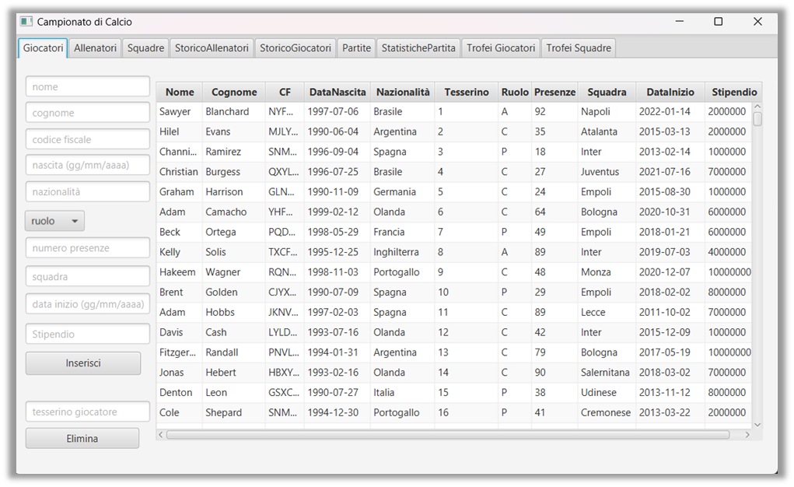

# Football Database

### A simple application to manage information about football championships


## Prerequisites


To run this application, you need to install on your machine:

- [MySQL](https://dev.mysql.com/downloads/mysql/) >= 8.0
- [Gradle](https://gradle.org/install/) >= 7.1

## Installation

To install this application you need to clone this repository and run the following commands:
```bash
git clone https://github.com/simonedode/football-database.git
cd football-database
```

### Build
To build the assets, you need to run the following command:
```bash
./gradlew build
```

## Configuration
To configure the database connection, you have to set the `DATABASE_*` variables in `app.config` file with your credentials
- `DATABASE_USERNAME`: The database username
- `DATABASE_PASSWORD`: The database password
- `DATABASE_TABLE`: The database table
> By default, the database credentials are:
> - `DATABASE_USERNAME`: root
>- `DATABASE_PASSWORD`: 
>- `DATABASE_TABLE`: football

## Run
To run the application you have to run the following command:
```bash
./gradlew run
```
